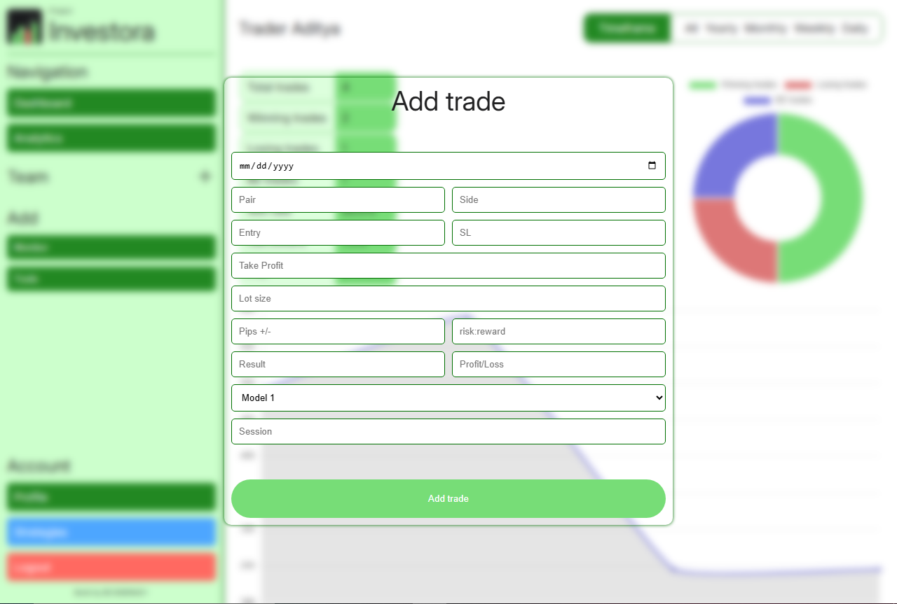

# Project Investora &bull; coderadi
**Version: 0.9.0 (Beta)** | **Status: Under Development**

A modern trading tracking & portfolio management tool designed for forex traders.

---

## Features (v0.9.3)
- ✅ **Portfolio Tracking** – Monitor trades, strategies.
- ✅ **Chart Dashboard** – Visualize performance trends.
- ✅ **Team Section** – You can see charts in teams section just like profile.
- ✅ **Strategies Section** – Yow you can add custom strategies that you've back tested.

**More features coming in v1.0!* *

--- 

## Tech Stack
- **Frontend**: HTML/CSS/JS
- **Backend**: Flask
- **Database**: SQLite
- **APIs**: Flask REST-API

---

`PyCODE` &bull; 2025 &bull; coderadi
