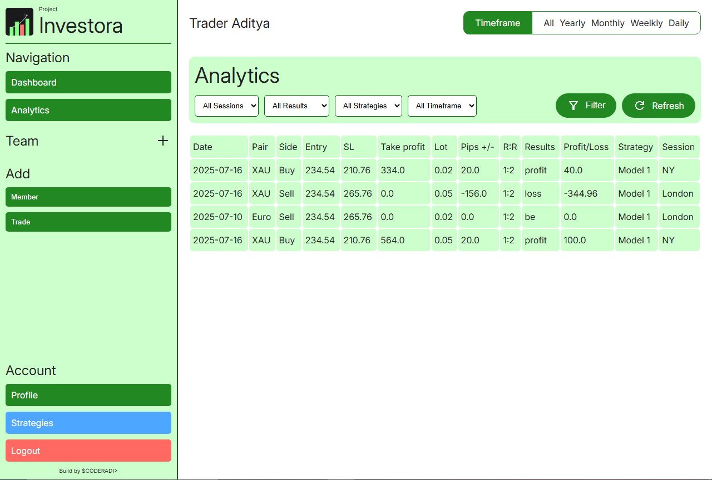

# Project Investora &bull; coderadi
**Version: 0.9.3 (Beta)** | **Status: Under development**

A modern trading tracking & portfolio management tool designed for forex traders.

---

## Features (v0.9.0)
- ✅ **Portfolio Tracking** – Monitor trades, strategies.
- ✅ **Chart Dashboard** – Visualize performance trends.

**More features coming in v1.0!* *

## What's new
- ✅ **Updated Team Section** – Now you can see charts in teams section just like profile.
- ✅ **Updated Strategies Section** – Now you can add custom strategies that you've back tested.

--- 

---

`PyCOD3` &bull; 2025 &bull; coderadi