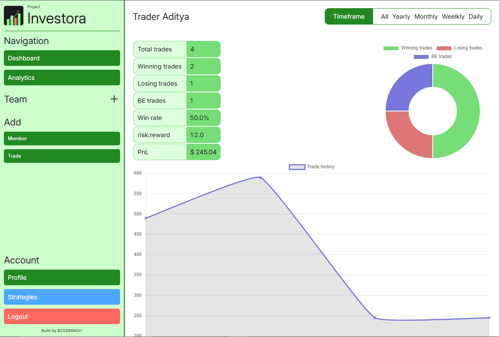
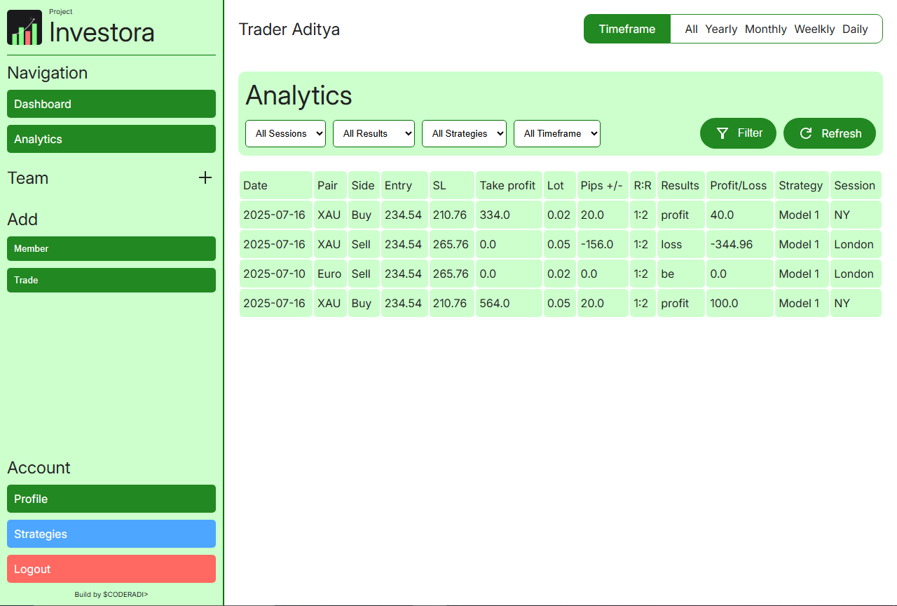
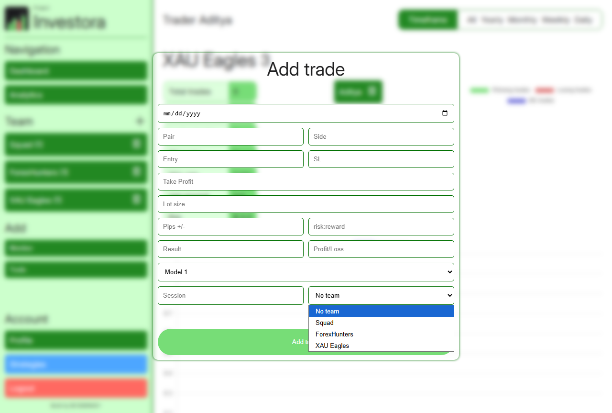

# Project Investora &bull; coderadi
**Version: 0.9.3 (Beta)** | **Status: Under development**

A modern trading tracking & portfolio management tool designed for forex traders.

---

## Features (v0.9.3)
- ✅ **Portfolio Tracking** – Monitor trades, strategies.
- ✅ **Chart Dashboard** – Visualize performance trends.
- ✅ **Team Section** - You can see charts in teams section just like profile.
- ✅ **Strategies Section** – You can add custom strategies that you've back tested.

**More features coming in v1.0!* *

## What's fixed
You may have encountered that the charts are not being rendered, it's was a small bug, that we've fixed.

## What's next
Next we're launching v.1.0.0 .

--- 

---

`PyCOD3` &bull; 2025 &bull; coderadi