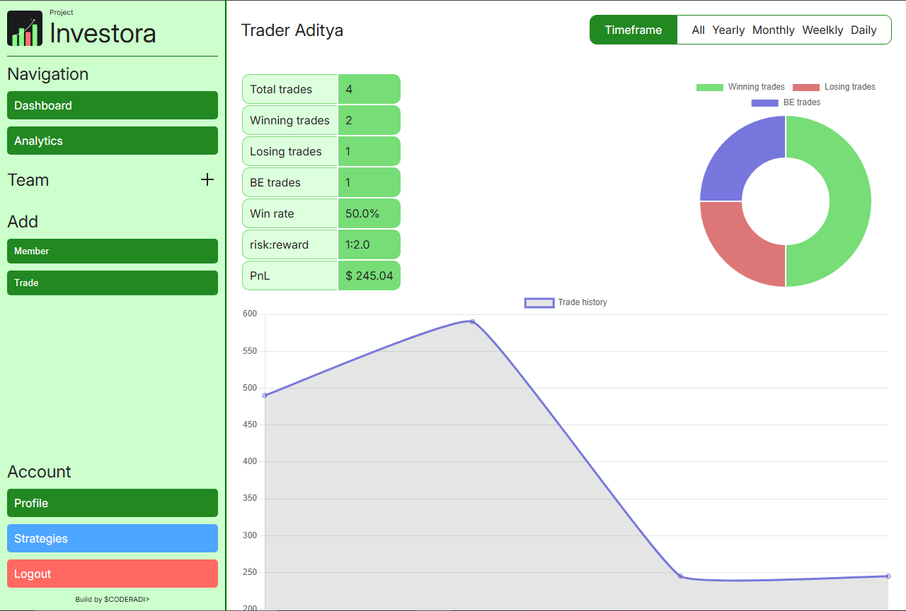
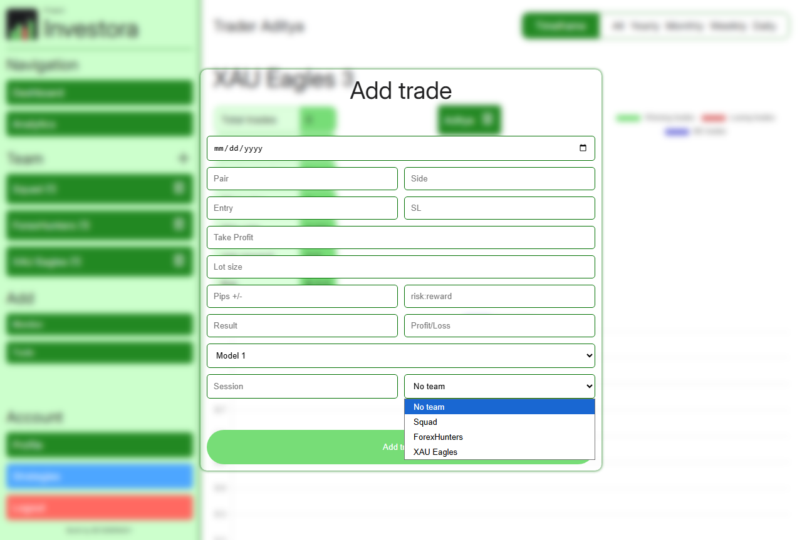

# Project Investora &bull; coderadi
**Version: 1.0.0 (Stable)** | **Status: Developed**

A modern trading tracking & portfolio management tool designed for forex traders.

---

## Features (v1.0.0)
- ✅ **Portfolio Tracking** – Monitor trades, strategies.
- ✅ **Chart Dashboard** – Visualize performance trends.
- ✅ **Team Section** - You can see charts in teams section just like profile.
- ✅ **Strategies Section** – You can add custom strategies that you've back tested.

## What's new in 1.0.0
- You may have encountered that the charts are not being rendered, it's was a small bug, that we've fixed.
- Additionally, we'ved added Google login option, that's better for security.

--- 

---

`PyCOD3` &bull; 2025 &bull; coderadi